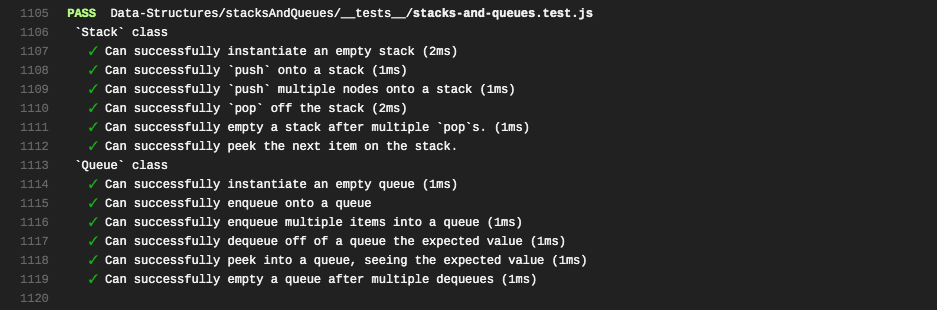
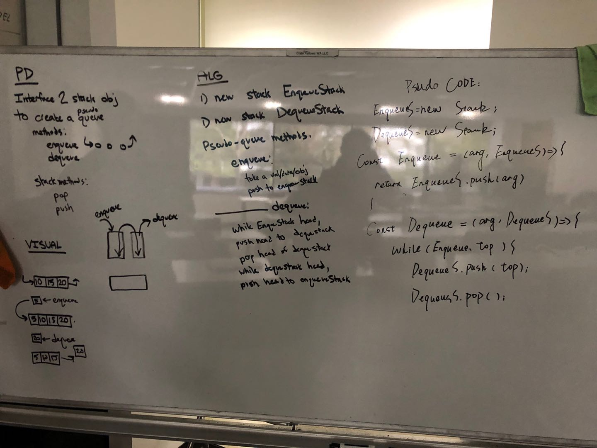

# Stacks and Queues
<!-- Short summary or background information -->
Implement a Stack and a Queue Data Structure

## Challenge
<!-- Description of the challenge -->
 * Create a Node class that has properties for the value stored in the Node, and a pointer to the next node.
 * Create a Stack class that has a top property. It creates an empty Stack when instantiated.
 * This object should be aware of a default empty value assigned to top when the stack is created.
 * Define a method called push which takes any value as an argument and adds a new node with that value to the top of the stack with an O(1) Time performance.
 * Define a method called pop that does not take any argument, removes the node from the top of the stack, and returns the node’s value.
 * Define a method called peek that does not take an argument and returns the value of the node located on the top of the stack.
 * Create a Queue class that has a top property. It creates an empty queue when instantiated.
 * This object should be aware of a default empty value assigned to front when the queue is created.
 * Define a method called enqueue which takes any value as an argument and adds a new node with that value to the back of the queue with an O(1) Time performance.
 * Define a method called dequeue that does not take any argument, removes the node from the front of the queue, and returns the node’s value.
 * Define a method called peek that does not take an argument and returns the value of the node located in the front of the stack.
 * At no time should an exception or stack trace be shown to the end user. Catch and handle any such exceptions and return a printed value or operation which cleanly represents the state and either stops execution cleanly, or provides the user with clear direction and output.
 * Be sure to follow your languages best practices for naming conventions.

## Approach & Efficiency
<!-- What approach did you take? Why? What is the Big O space/time for this approach? -->

## API
<!-- Description of each method publicly available to your Stack and Queue-->

# Queue with stacks
<!-- Short summary or background information -->
Implement a Queue using two Stacks.

## Challenge
<!-- Description of the challenge -->
 #### Create a brand new PseudoQueue class. Do not use an existing Queue. Instead, this PseudoQueue class will implement our standard queue interface (the two methods listed below), but will internally only utilize 2 Stack objects. Ensure that you create your class with the following methods:

* enqueue(value) which inserts value into the PseudoQueue, using a first-in, first-out approach.
* dequeue() which extracts a value from the PseudoQueue, using a first-in, first-out approach.
##### The Stack instances have only push, pop, and peek methods. You should use your own Stack implementation. Instantiate these Stack objects in your PseudoQueue constructor.

## Approach & Efficiency
<!-- What approach did you take? Why? What is the Big O space/time for this approach? -->

## Whiteboard

# fifo_animal_shelter
<!-- Short summary or background information -->
First-in, First out Animal Shelter.

## Challenge
<!-- Description of the challenge -->
 #### Create a class called AnimalShelter which holds only dogs and cats. The shelter operates using a first-in, first-out approach.
 
##### Implement the following methods:
* enqueue(animal): adds animal to the shelter. animal can be either a dog or a cat object.
* dequeue(pref): returns either a dog or a cat. If pref is not "dog" or "cat" then return null.

## Approach & Efficiency
<!-- What approach did you take? Why? What is the Big O space/time for this approach? -->

## Whiteboard

