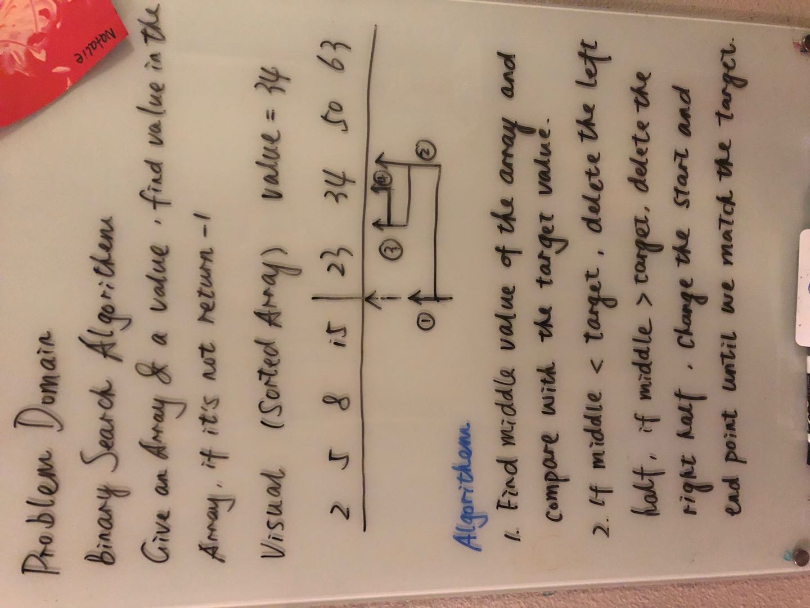

# data-structures-and-algorithms
Part of growing as a programmer is to practice, practice, practice. Throughout this repo, I will complete a set of daily code challenges. Each set will contain up to ten problems.

# Contents
## Code Challenges
* [Reverse an array](# Reverse an Array) 
* [Insert and shift an array in middle at index](# Insert and shift an array in middle at index) 
* [Binary search in a sorted array](# Binary search in a sorted array) 

## Data Structures
* [Linked list](#Singly Linked List)

# Reverse an Array
Write a function called reverseArray which takes an array as an argument. Without utilizing any of the built-in methods available to your language, return an array with elements in reversed order.

## Challenge
<!-- Description of the challenge -->
The challenge is how to get the element from the end of the array.

## Approach & Efficiency
<!-- What approach did you take? Why? What is the Big O space/time for this approach? -->
I reverse the array by define a new array and push the element of the array from last to first.

## Solution
<!-- Embedded whiteboard image -->

# Insert and shift an array in middle at index
Write a function called insertShiftArray which takes in an array and the value to be added. Without utilizing any of the built-in methods available to your language, return an array with the new value added at the middle index

## Challenge
<!-- Description of the challenge -->
The challenge is how to put the number to be added into the middle index.

## Approach & Efficiency
<!-- What approach did you take? Why? What is the Big O space/time for this approach? -->
I find the middle index first and then move those numbers behind and make an empty position for the number to be added

## Solution

# Binary search in a sorted array
Write a function called BinarySearch which takes in 2 parameters: a sorted array and the search key. Without utilizing any of the built-in methods available to your language, return the index of the array’s element that is equal to the search key, or -1 if the element does not exist.

## Challenge
The challenge is how to change the middle point automatically and continue the process untill find the target number.

## Approach & Efficiency
 After deciding which side to choose adjust the start index and end index

## Solution

# Singly Linked List
1. Create a Node class that has properties for the value stored in the Node, and a pointer to the next Node.
2. Within your LinkedList class, include a head property. Upon instantiation, an empty Linked List should be created.
3. This object should be aware of a default empty value assigned to head when the linked list is instantiated.
4. Define a method called insert which takes any value as an argument and adds a new node with that value to the head of the list with an O(1) Time performance.
5. Define a method called includes which takes any value as an argument and returns a boolean result depending on whether that value exists as a Node’s value somewhere within the list.
6. Define a method called print which takes in no arguments and returns a collection all of the current Node values in the Linked List.

## ChallengeCan successfully instantiate an empty linked list
1. Can properly insert into the linked list
2. The head property will properly point to the first node in the linked list
3. Can properly insert multiple nodes into the linked list
4. Will return true when finding a value within the linked list that exists
5. Will return false when searching for a value in the linked list that does not exist
6. Can properly return a collection of all the values that exist in the linked list

## Approach & Efficiency
Followed the instruction of reading documents
