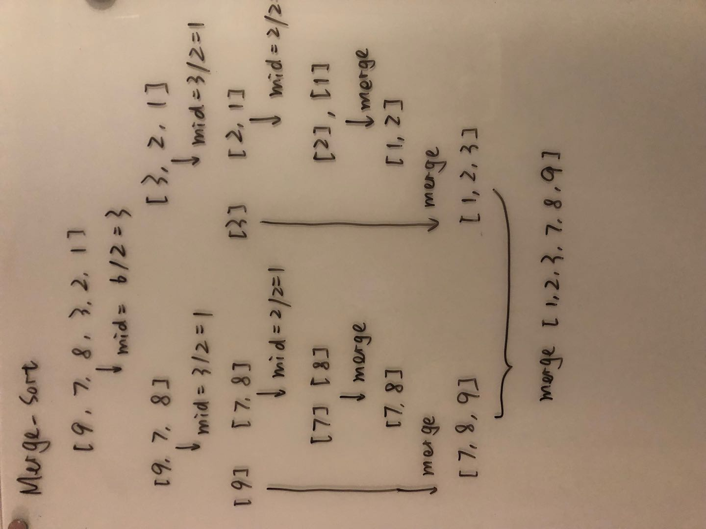

# Merge sort

## Learning Objectives
* What is merge-sort
* How to describe the Algorithm
* How does it visually looks like
* What's the pseudocode
* How to implement 

## Lecture Flow

### Main Point
Merge sort is one of the commonly used sorting algorithms in computer science. It is used by Firefox and Safari in their implementation of Array.prototype.sort(). It has good performance, it’s easy to implement and understand.

### Supporting Points
It all revolves around the idea that it’s easier to sort two sorted arrays rather than one unsorted one. Once we have our two sorted arrays we start comparing their items one by one and adding the smaller item in our result list. Imagine that you’ve got two lists A and B. You compare A[0] to B[0]. Let’s say that A[0] is smaller — we add it to the result list and continue. Then we compare A[1] to B[0]. This time B[0] is the smaller one so we add it and continue comparing A[1] to B[1] and so on…
At the end of the sorting any left variables are concatenated at the end of our results list — since the A and B arrays are already sorted this will not cause reordering.

## Diagram

## Algorithm
1. Divide the unsorted list into N sublists, each containing 1 element.
2. Take adjacent pairs of two singleton lists and merge them to form a list of 2 elements.     N will now convert into N/2 lists of size 2.
3. Repeat the process till a single sorted list of obtained.

## Pseudocode
func mergesort( var a as array )
     if ( n == 1 ) return a

     var l1 as array = a[0] ... a[n/2]
     var l2 as array = a[n/2+1] ... a[n]

     l1 = mergesort( l1 )
     l2 = mergesort( l2 )

     return merge( l1, l2 )
end func

func merge( var a as array, var b as array )
     var c as array

     while ( a and b have elements )
          if ( a[0] > b[0] )
               add b[0] to the end of c
               remove b[0] from b
          else
               add a[0] to the end of c
               remove a[0] from a
     while ( a has elements )
          add a[0] to the end of c
          remove a[0] from a
     while ( b has elements )
          add b[0] to the end of c
          remove b[0] from b
     return c
end func

## Readings and References

### Read
* Essential
[Merge sort](https://www.algorithmist.com/index.php/Merge_sort)
[Merge sort](https://www.hackerearth.com/practice/algorithms/sorting/merge-sort/tutorial)
[Programming with merge sort](https://hackernoon.com/programming-with-js-merge-sort-deb677b777c0)

* Watch
[Merge sort](https://visualgo.net/en/sorting)