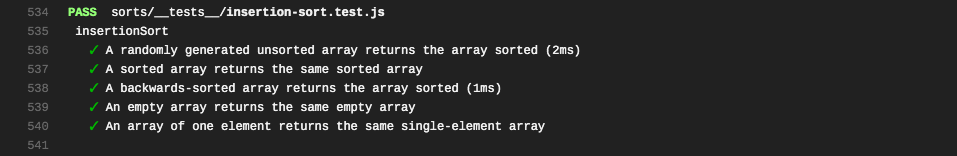

# Sorts
## Insertion Sort
Implement Insertion Sort
;

### Challenge
Write a function for insertion sort that takes in an unsorted array and returns the array sorted using insertion sort.

### Approach & Efficiency
Time O(n)
Space O(1)

## Merge Sort
Implement merge Sort
;

### Challenge
Write a function for merge sort that takes in an unsorted array and returns the array sorted using merge sort.

### Approach & Efficiency
Time O(n)
Space O(nlogn)